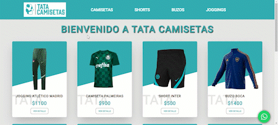

# Tata Camisetas

Bienvenido a Tata Camisetas. Soy Tomás Dalla Bona.

> Ecommerce.

This product is being built

## Running Locally

```bash
$ git clone https://github.com/tomdb03/tatacamisetas-Dalla-Bona-React.git
$ cd tatacamisetas-Dalla-Bona-React
$ npm install
$ npm start
```

## Environment Variables

See [`.env.example`](https://github.com/szuviria/zuvcommerce/blob/main/.env.example) for an example.

## Built Using

- [Create-React-App](https://create-react-app.dev/)
- [Firebase](https://firebase.com)

## Rutas

- '/' navega a <ItemListContainer.js />, mostrando todos los productos.
- '/category/:categoryId' navega a <ItemListContainer.js />, pero filtrando por categoría.
- '/detail/:productId' navega a <ItemDetailContainer.js />, mostrando el detalle del producto dependiendo del parámetro de URL.

## Navegación

